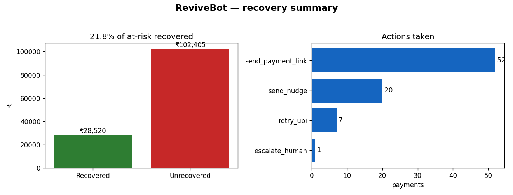

# ReviveBot

**AI Revenue Recovery Agent — Razorpay Buildathon 2025, Track 03**

ReviveBot monitors a merchant's failed-payment stream, diagnoses each failure,
picks the right recovery action, executes it **within safe bounds**, and logs
every decision for audit — no human in the loop. The output is measured money:
₹ recovered vs. ₹ at risk, not just "emails sent".

```
synthetic_payments.csv
        │
        ▼
[ Signal Detector ]   classify failure type  (insufficient_funds, network_error,
        │                                      user_abandoned, mandate_broken,
        │                                      invoice_overdue, permanent_failure)
        ▼
[ Diagnosis Engine ]  Groq -> {action, reason, confidence, channel, ...}
        │             (JSON validated with Pydantic; rule fallback offline)
        ▼
[ Recovery Executor ] stopping rules first, then act
        │             retry_upi / send_payment_link (Razorpay test) | send_nudge (mock)
        │             escalate_human | do_nothing
        ▼
[ Audit Logger ]      every decision + outcome -> audit.db
        ▼
[ Report Generator ]  recovery_report.md + results.csv
```

## Quick start

Runs end-to-end **with no credentials** — diagnosis falls back to deterministic
rules and comms are mocked, so you can see the full pipeline immediately.

```bash
pip install -r requirements.txt
python scripts/generate_data.py     # writes data/synthetic_payments.csv (80 rows)
python main.py                      # runs the batch, writes report + audit.db
```

Sample run headline:

```
Batch: 80 | At risk: ₹130,924.96 | Recovered: ₹28,519.99 (21.8%)
```

Every run also writes a summary chart (`recovery_chart.png`) next to the report:



To use the **real** Groq diagnosis and Razorpay test-mode payment links, copy
`.env.example` to `.env` and fill in your keys:

```bash
cp .env.example .env    # then set GROQ_API_KEY and/or RAZORPAY_KEY_ID/SECRET
```

- With `GROQ_API_KEY` set, diagnosis calls Groq (`openai/gpt-oss-120b` by
  default; override with `GROQ_MODEL`). Groq runs in JSON mode and the reply is
  validated against the `ActionPlan` schema with Pydantic, so a malformed reply
  is caught instead of crashing the batch.
- With `RAZORPAY_KEY_ID` / `RAZORPAY_KEY_SECRET` set (test keys, `rzp_test_…`),
  `retry_upi` / `send_payment_link` create real **test-mode** payment links. No
  real money moves.
- Recovery *outcomes* are simulated deterministically (seeded by `payment_id`)
  so the report shows stable, measurable numbers without live settlement.

## Architecture

| Layer | File | What it does |
| --- | --- | --- |
| Signal detector | `revivebot/detector.py` | Classifies each record into a failure bucket |
| Diagnosis engine | `revivebot/diagnosis.py` | Groq action plan (JSON validated) + rule fallback |
| Recovery executor | `revivebot/executor.py` | Stopping rules, then Razorpay test API / mock comms |
| Audit logger | `revivebot/audit.py` | Writes every decision + outcome to SQLite |
| Report generator | `revivebot/report.py` | Produces `recovery_report.md` + `results.csv` |
| Entry point | `main.py` | Wires the batch loop together |
| Config | `config.py` | Keys, model, thresholds, stopping rules |

## Tests

```bash
pip install pytest
pytest
```

The suite covers the detector's buckets, every compliance stopping rule, and
the report maths — the parts that must stay correct.

## Stopping rules & compliance

What makes this Track 03 and not just a retry script — the executor checks these
**before** any action (`config.py`, `executor.py`):

| Rule | Condition | Outcome |
| --- | --- | --- |
| Max retries | `attempts >= 3` | `max_retries_reached`, escalate |
| Do-not-contact | customer in `data/dnc_list.csv` | `skipped_dnc`, never contact |
| Permanent failure | `failure_reason = PERMANENT_FAILURE` | `unrecoverable`, no action |
| Low confidence | model confidence `< 0.5` | `escalated_low_confidence` |
| High value | `amount > ₹50,000` | `escalated_high_value`, never auto-retry |

The synthetic batch includes deliberately tricky records that trigger each of
these (`pay_Test_010`, `_017`, `_026`, `_034`, `_043`, `_061`) so the
graceful-failure handling is visible in the report and audit log.

## What broke (honest notes)

- Windows consoles default to cp1252 and can't print `₹`; `main.py` reconfigures
  stdout to UTF-8 at startup.
- Early versions had no stopping rules — the agent would have retried a DNC
  customer repeatedly. The DNC and max-retry checks now run before every action.
- The high-value escalation threshold is in **paise**; the test record had to be
  set above ₹50,000 (6,000,000 paise) for the rule to fire.

## Layout

```
ReviveBot/
├── data/synthetic_payments.csv     # generated test batch (80 rows)
│   └── dnc_list.csv                # do-not-contact list (loaded by config)
├── revivebot/                      # detector, diagnosis, executor, audit, report
├── scripts/generate_data.py        # synthetic data generator (seeded)
├── sample_output/                  # report + results.csv + audit.db from a run
├── main.py
├── config.py
├── requirements.txt
└── .env.example
```

---
_Built for Razorpay Buildathon 2025 · Track 03: AI Revenue Recovery._
